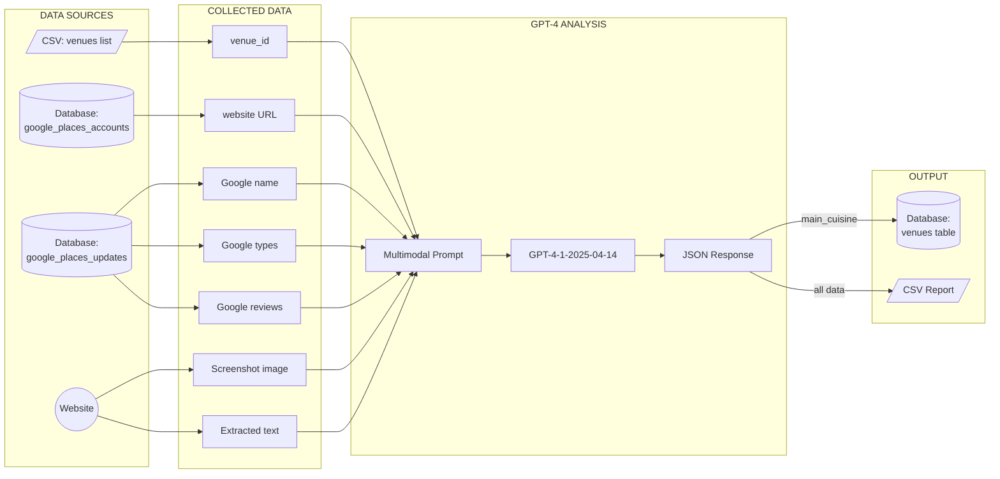
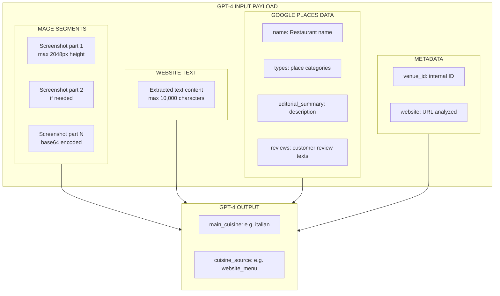
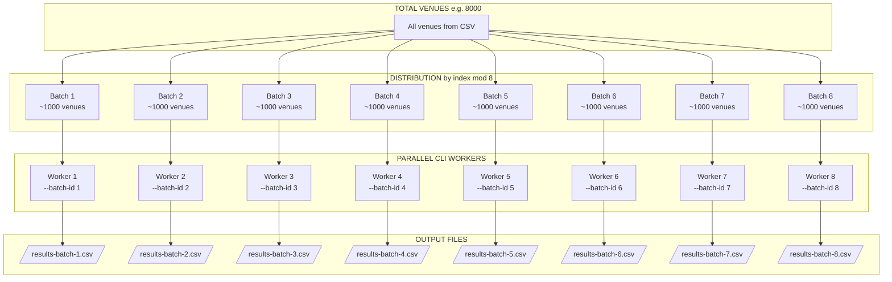
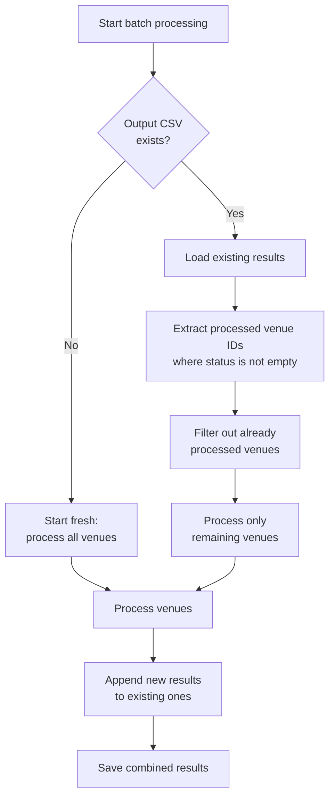

# Automated Cuisine Type Extraction Process

## Overview

This system automatically analyzes restaurant websites using artificial intelligence (GPT-4) to determine the type of cuisine served and update the venue database.

## Detailed Process Flow Diagram

```mermaid
flowchart TD
    subgraph INPUT["INPUT DATA SOURCES"]
        CSV[/"CSV File: venues-without-cuisine.csv"/]
        BATCH_PARAM[/"Command Parameter: --batch-id 1-8"/]
    end

    subgraph INIT["INITIALIZATION"]
        VALIDATE_BATCH{Validate batch-id<br/>1 to 8?}
        VALIDATE_FILE{Input file exists?}
        LOAD_CSV[Load all venues from CSV]
        FILTER_BATCH[Filter venues for batch<br/>index mod 8 = batch-1]
        LOAD_EXISTING[Load existing results<br/>for resume capability]
        CALC_REMAINING[Calculate remaining<br/>venues to process]
    end

    CSV --> VALIDATE_FILE
    BATCH_PARAM --> VALIDATE_BATCH

    VALIDATE_BATCH -->|Invalid| FAIL_BATCH[/"FAIL: Invalid batch-id"/]
    VALIDATE_BATCH -->|Valid| VALIDATE_FILE
    VALIDATE_FILE -->|Not found| FAIL_FILE[/"FAIL: File not found"/]
    VALIDATE_FILE -->|Exists| LOAD_CSV
    LOAD_CSV --> FILTER_BATCH
    FILTER_BATCH --> LOAD_EXISTING
    LOAD_EXISTING --> CALC_REMAINING
    CALC_REMAINING --> LOOP_START

    subgraph LOOP["PROCESS EACH VENUE"]
        LOOP_START{More venues<br/>to process?}

        subgraph GOOGLE_DATA["GOOGLE PLACES DATA"]
            GET_ACCOUNT[Query GooglePlacesAccountsRepository]
            CHECK_ACCOUNT{Google Place<br/>Account exists?}
            GET_UPDATE[Query GooglePlacesUpdatesRepository]
            CHECK_UPDATE{Google Places<br/>data exists?}
            EXTRACT_WEBSITE[Extract website URL<br/>from payload]
            CHECK_WEBSITE{Website URL<br/>present?}
            EXTRACT_GP_DATA[Extract: name, types,<br/>editorial_summary, reviews]
        end

        subgraph WEB_CRAWL["WEBSITE CRAWLING"]
            TAKE_SCREENSHOT[WebCrawlingService:<br/>takeScreenshotAndExtractText]
            CHECK_SCREENSHOT{Screenshot<br/>successful?}
            TRUNCATE_TEXT[Truncate text to<br/>max 10,000 chars]
            SPLIT_IMAGE[ImageSplitterService:<br/>split to max 2048px height]
        end

        subgraph AI_ANALYSIS["AI ANALYSIS - GPT-4"]
            BUILD_PROMPT[Build multimodal prompt:<br/>images + text + google data]
            CALL_AI[OpenAI.createResponse<br/>Model: GPT-4-1-2025-04-14]
            PARSE_RESPONSE[Parse JSON response:<br/>main_cuisine, cuisine_source]
        end

        subgraph VALIDATION["VALIDATION AND UPDATE"]
            CHECK_CUISINE{Cuisine returned<br/>and not unknown?}
            VALIDATE_ENUM[Cuisine::tryFrom<br/>validate against enum]
            CHECK_VALID{Is valid<br/>cuisine type?}
            UPDATE_DB[VenuesRepository:<br/>setCuisines and save]
        end

        subgraph RESULT["RESULT TRACKING"]
            RESULT_SUCCESS[/"SUCCESS: cuisine saved"/]
            RESULT_NO_ACCOUNT[/"FAIL: missing_google_place_id"/]
            RESULT_NO_DATA[/"FAIL: missing_google_place_data"/]
            RESULT_NO_WEBSITE[/"FAIL: missing_website"/]
            RESULT_NO_SCREENSHOT[/"FAIL: screenshot_failed"/]
            RESULT_AI_UNKNOWN[/"FAIL: ai_cannot_determine"/]
            RESULT_INVALID[/"FAIL: cuisine_invalid"/]
            RESULT_ERROR[/"FAIL: error exception"/]
        end
    end

    LOOP_START -->|No| FINALIZE
    LOOP_START -->|Yes| GET_ACCOUNT

    GET_ACCOUNT --> CHECK_ACCOUNT
    CHECK_ACCOUNT -->|No| RESULT_NO_ACCOUNT
    CHECK_ACCOUNT -->|Yes| GET_UPDATE

    GET_UPDATE --> CHECK_UPDATE
    CHECK_UPDATE -->|No| RESULT_NO_DATA
    CHECK_UPDATE -->|Yes| EXTRACT_WEBSITE

    EXTRACT_WEBSITE --> CHECK_WEBSITE
    CHECK_WEBSITE -->|No| RESULT_NO_WEBSITE
    CHECK_WEBSITE -->|Yes| EXTRACT_GP_DATA

    EXTRACT_GP_DATA --> TAKE_SCREENSHOT
    TAKE_SCREENSHOT --> CHECK_SCREENSHOT
    CHECK_SCREENSHOT -->|No| RESULT_NO_SCREENSHOT
    CHECK_SCREENSHOT -->|Yes| TRUNCATE_TEXT

    TRUNCATE_TEXT --> SPLIT_IMAGE
    SPLIT_IMAGE --> BUILD_PROMPT
    BUILD_PROMPT --> CALL_AI
    CALL_AI --> PARSE_RESPONSE
    PARSE_RESPONSE --> CHECK_CUISINE

    CHECK_CUISINE -->|No/Unknown| RESULT_AI_UNKNOWN
    CHECK_CUISINE -->|Yes| VALIDATE_ENUM

    VALIDATE_ENUM --> CHECK_VALID
    CHECK_VALID -->|No| RESULT_INVALID
    CHECK_VALID -->|Yes| UPDATE_DB
    UPDATE_DB --> RESULT_SUCCESS

    RESULT_SUCCESS --> SAVE_CHECK
    RESULT_NO_ACCOUNT --> SAVE_CHECK
    RESULT_NO_DATA --> SAVE_CHECK
    RESULT_NO_WEBSITE --> SAVE_CHECK
    RESULT_NO_SCREENSHOT --> SAVE_CHECK
    RESULT_AI_UNKNOWN --> SAVE_CHECK
    RESULT_INVALID --> SAVE_CHECK
    RESULT_ERROR --> SAVE_CHECK

    subgraph PERIODIC_SAVE["PERIODIC SAVE"]
        SAVE_CHECK{Processed count<br/>mod 10 = 0?}
        SAVE_PARTIAL[Write results to CSV]
    end

    SAVE_CHECK -->|Yes| SAVE_PARTIAL
    SAVE_PARTIAL --> LOOP_START
    SAVE_CHECK -->|No| LOOP_START

    subgraph OUTPUT["OUTPUT AND SUMMARY"]
        FINALIZE[Write final results to CSV]
        SUMMARY[Print summary by status]
        LOG_SUMMARY[Log with AI_CUISINE_EXTRACTION tag]
        OUTPUT_FILE[/"Output: cuisine-extraction-results-batch-N.csv"/]
    end

    FINALIZE --> SUMMARY
    SUMMARY --> LOG_SUMMARY
    LOG_SUMMARY --> OUTPUT_FILE

    %% Styling
    classDef inputData fill:#e3f2fd,stroke:#1565c0,stroke-width:2px
    classDef process fill:#fff8e1,stroke:#f9a825,stroke-width:2px
    classDef decision fill:#fce4ec,stroke:#c2185b,stroke-width:2px
    classDef success fill:#e8f5e9,stroke:#2e7d32,stroke-width:2px
    classDef error fill:#ffebee,stroke:#c62828,stroke-width:2px
    classDef ai fill:#ede7f6,stroke:#6a1b9a,stroke-width:2px
    classDef google fill:#fff3e0,stroke:#ef6c00,stroke-width:2px
    classDef web fill:#e0f7fa,stroke:#00838f,stroke-width:2px
    classDef output fill:#f3e5f5,stroke:#7b1fa2,stroke-width:2px

    class CSV,BATCH_PARAM,OUTPUT_FILE inputData
    class LOAD_CSV,FILTER_BATCH,LOAD_EXISTING,CALC_REMAINING,TRUNCATE_TEXT,SPLIT_IMAGE,VALIDATE_ENUM,UPDATE_DB,FINALIZE,SUMMARY,LOG_SUMMARY process
    class VALIDATE_BATCH,VALIDATE_FILE,LOOP_START,CHECK_ACCOUNT,CHECK_UPDATE,CHECK_WEBSITE,CHECK_SCREENSHOT,CHECK_CUISINE,CHECK_VALID,SAVE_CHECK decision
    class RESULT_SUCCESS success
    class FAIL_BATCH,FAIL_FILE,RESULT_NO_ACCOUNT,RESULT_NO_DATA,RESULT_NO_WEBSITE,RESULT_NO_SCREENSHOT,RESULT_AI_UNKNOWN,RESULT_INVALID,RESULT_ERROR error
    class BUILD_PROMPT,CALL_AI,PARSE_RESPONSE ai
    class GET_ACCOUNT,GET_UPDATE,EXTRACT_WEBSITE,EXTRACT_GP_DATA google
    class TAKE_SCREENSHOT web
    class SAVE_PARTIAL output
```

## Data Flow Summary

## AI Input Composition

## Batch Processing Architecture

## Resume Capability Flow

## Status Codes Reference

| Status | Meaning | Recommended Action |
|--------|---------|-------------------|
| `success` | Cuisine identified and saved to database | None required |
| `failure_missing_google_place_id` | Venue has no linked Google Places account | Link venue to Google Place ID |
| `failure_missing_google_place_data` | No cached Google Places data available | Run Google Places sync for venue |
| `failure_missing_website` | Google Places data has no website URL | Add website in Google Business Profile |
| `failure_screenshot_failed` | Could not capture website screenshot | Check if website is accessible |
| `failure_ai_cannot_determine` | AI returned "unknown" or empty cuisine | Manual classification needed |
| `failure_cuisine_invalid` | AI returned cuisine not in allowed list | Consider adding new cuisine type |
| `failure_error` | Unexpected exception during processing | Check error logs |

## Output CSV Structure

| Column | Description | Example Values |
|--------|-------------|----------------|
| `venue_id` | Internal venue ID | 12345 |
| `venue_name` | Venue name | "La Pizzeria" |
| `website` | Analyzed website URL | "https://lapizzeria.com" |
| `cuisine_type` | AI-determined cuisine | "italian", "asian", "french" |
| `cuisine_source` | Where AI found the info | "website_menu", "google_reviews" |
| `is_cuisine_valid` | Matches allowed enum | "true" / "false" |
| `db_updated` | Was database updated | "true" / "false" |
| `status` | Final processing status | See status table above |

## Key Services and Dependencies

| Service | Purpose |
|---------|---------|
| `GooglePlacesAccountsRepository` | Find Google Place account by venue ID |
| `GooglePlacesUpdatesRepository` | Get latest Google Places data for venue |
| `WebCrawlingService` | Capture website screenshot and extract text |
| `ImageSplitterService` | Split large screenshots into processable segments |
| `ExtractCuisineFromVenueWebsitePromptFactory` | Build AI prompt with all collected data |
| `OpenAI` | Send request to GPT-4 and parse response |
| `VenuesRepository` | Update venue cuisine in database |