# AI Follow-Ups - Complete Logic and Conditions

Document explaining ALL conditions for when the system generates and sends automatic follow-ups.

---

## Table of Contents
1. [Quick Reference Summary](#summary)
2. [Main Flow](#main-flow)
3. [PHASE 1: Qualification for Assessment](#phase-1-qualification)
4. [PHASE 2: AI Assessment](#phase-2-ai-assessment)
5. [PHASE 3: Automatic Sending](#phase-3-automatic-sending)
6. [Working Hours and Postponement](#working-hours)
7. [Anti-Spam Protection (25 minutes)](#anti-spam)
8. [Deletion of Obsolete Follow-ups](#deletion)
9. [All Time Thresholds](#time-thresholds)
10. [FAQ for Product Designer](#faq)

---

## Summary

### When CAN the system generate a follow-up?

| # | Condition | Value | Source File |
|---|-----------|-------|-------------|
| 1 | RFP status | SENT or ACTIVE (or has `still_in_progress_at`) | RfpIdsForFollowUpAssessmentQuery:57-58 |
| 2 | DE status | NEW or IN_PROGRESS | DirectEnquiriesForFollowUpAssessmentQuery:52 |
| 3 | Enquiry status | SENT or ACTIVE | RfpIdsForFollowUpAssessmentQuery:62 |
| 4 | Enquiry | NOT archived, NOT deleted | RfpIdsForFollowUpAssessmentQuery:60-61 |
| 5 | Thread | NOT deleted | RfpIdsForFollowUpAssessmentQuery:65 |
| 6 | Enquiry age | Created max 3 months ago | RfpIdsForFollowUpAssessmentQuery:63 |
| 7 | Event date | In the future | RfpIdsForFollowUpAssessmentQuery:64 |
| 8 | Pending follow-up | NO unsent follow-up exists | RfpIdsForFollowUpAssessmentQuery:51-54,66 |
| 9 | Last manager message | EXISTS | RfpIdsForFollowUpAssessmentQuery:71-75 |
| 10 | Last manager message | is NOT a follow-up | RfpIdsForFollowUpAssessmentQuery:77-80 |
| 11 | Time since last msg | >= 30 hours | RfpIdsForFollowUpAssessmentQuery:82-86 |
| 12 | Time since last msg | <= 15 days | RfpIdsForFollowUpAssessmentQuery:88-92 |
| 13 | Assessment lock | NOT assessed in last 12 hours | FollowUpAssessmentTracker:11 |

### When WILL the system send automatically?

| # | Condition | Value | What happens if NOT met |
|---|-----------|-------|------------------------|
| 1 | Generation type | AUTOMATIC | Waits for manual sending |
| 2 | Manager setting | `hasAutomaticAiFollowUpsEnabled() = true` | Waits for manual sending |
| 3 | Client email | Can be determined | Error, follow-up deleted |
| 4 | Working hours | 9:00-17:00 (venue timezone) | **POSTPONED** to next 9:00 AM |
| 5 | Recent auto-followup | Client didn't receive one in last 25 min | **DELAYED** - will retry later |

---

## Main Flow

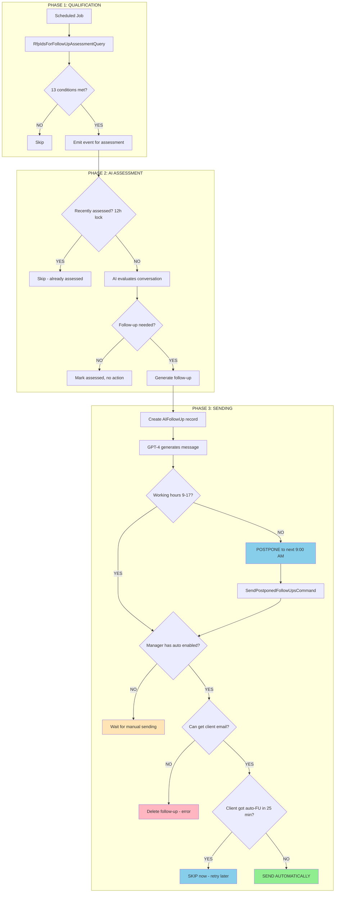

---

## PHASE 1: Qualification

### All 13 Conditions for RFP Qualification

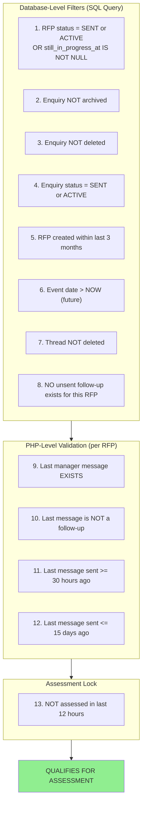

### Conditions for Direct Enquiry Qualification

| # | Condition | Value |
|---|-----------|-------|
| 1 | DE status | NEW or IN_PROGRESS |
| 2 | DE | NOT deleted |
| 3 | Created | within last 3 months |
| 4 | Event date | in the future |
| 5 | Thread | NOT deleted |
| 6 | Pending follow-up | NO unsent follow-up exists |
| 7 | Last manager message | EXISTS |
| 8 | Last message | is NOT a follow-up |
| 9 | Time since last msg | >= 30 hours |
| 10 | Time since last msg | <= 15 days |
| 11 | Assessment lock | NOT assessed in last 12 hours |

### Time Window Explanation (30h - 15 days)

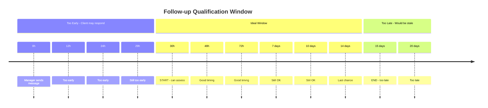

---

## PHASE 2: AI Assessment

### Assessment Flow

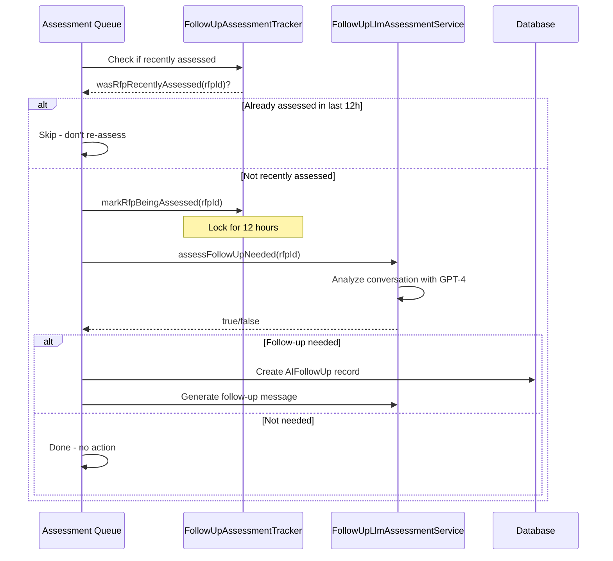

---

## PHASE 3: Automatic Sending

### All Sending Conditions (in order)

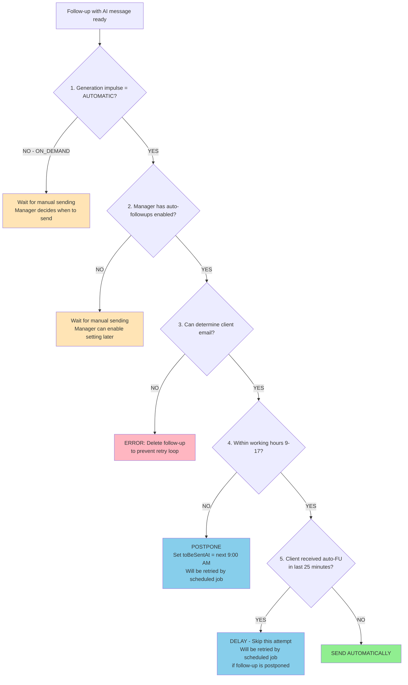

---

## Working Hours

### Working Hours Definition

| Parameter | Value | Source |
|-----------|-------|--------|
| Start | 9:00 AM | WorkingHoursCalculator:12 |
| End | 5:00 PM (17:00) | WorkingHoursCalculator:13 |
| Timezone | Venue's timezone (or server default) | SendAIFollowUpAutomaticallyOrPostponeListener:49 |

```mermaid
gantt
    title Working Hours for Automatic Follow-ups
    dateFormat HH:mm
    axisFormat %H:%M

    section Outside Hours (POSTPONE)
    Night 00:00-09:00     :crit, 00:00, 9h

    section Working Hours (CAN SEND)
    Can send 09:00-17:00 :active, 09:00, 8h

    section Outside Hours (POSTPONE)
    Evening 17:00-24:00 :crit, 17:00, 7h
```

### Postponement Logic

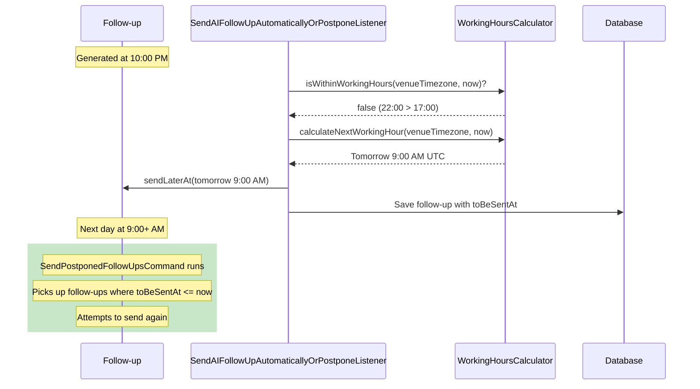

---

## Anti-Spam

### The 25-Minute Protection - IMPORTANT EXPLANATION

**What it is**: Protection against sending multiple automatic follow-ups to the same client in a short time.

**What it checks**: Did this client's email receive ANY automatic follow-up (from any RFP or Direct Enquiry) in the last 25 minutes?

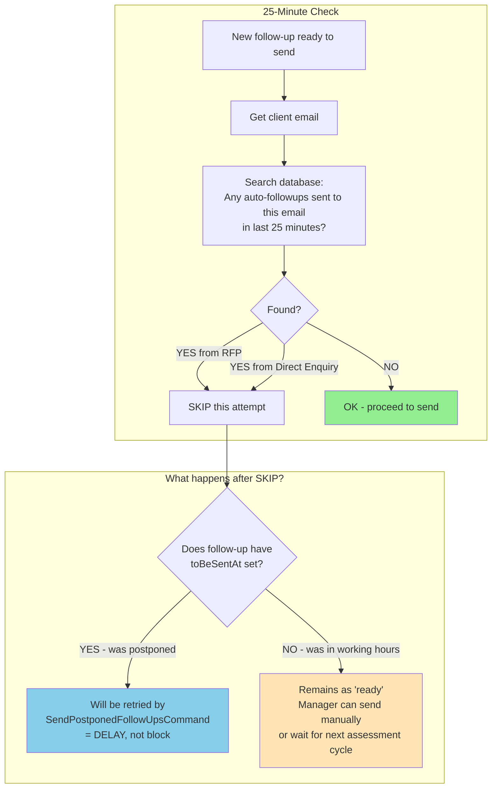

### Key Point: 25 Minutes is a DELAY, not a BLOCK

| Scenario | What happens | Result |
|----------|--------------|--------|
| Follow-up generated **OUTSIDE** working hours | Has `toBeSentAt` set → `SendPostponedFollowUpsCommand` will retry | **DELAY** - will be sent later |
| Follow-up generated **INSIDE** working hours, 25min check fails | No `toBeSentAt` → stays as "ready" | Manager can send manually, or new follow-up will be generated in next cycle |

**Why 25 minutes?**
- Same client might have multiple enquiries to different venues
- These venues might be managed by the same manager
- Without this check, client could receive 3-4 follow-ups within minutes

---

## Deletion

### All Deletion Conditions for RFP Follow-ups

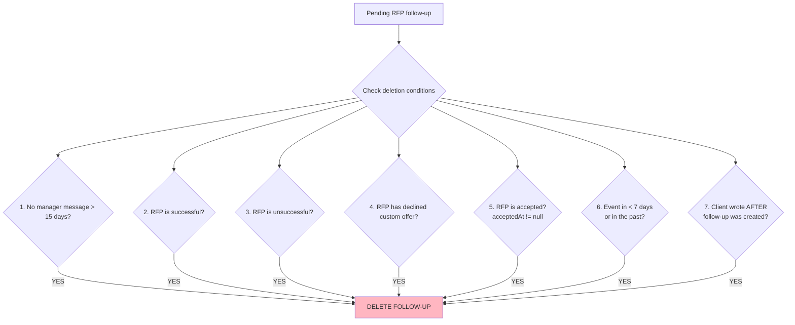

### All Deletion Conditions for Direct Enquiry Follow-ups

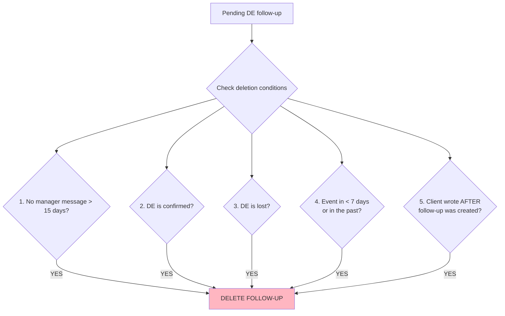

### Deletion Reasons Summary

| # | Condition | Applies to | Why delete? |
|---|-----------|------------|-------------|
| 1 | No manager message > 15 days | RFP, DE | Conversation probably dead |
| 2 | RFP successful | RFP | Deal won - no need for follow-up |
| 3 | RFP unsuccessful | RFP | Deal lost - no need for follow-up |
| 4 | RFP declined custom offer | RFP | Client rejected offer |
| 5 | RFP accepted | RFP | Deal in progress |
| 6 | DE confirmed | DE | Booking confirmed |
| 7 | DE lost | DE | Deal lost |
| 8 | Event in < 7 days or past | RFP, DE | Too late for follow-up |
| 9 | Client wrote after follow-up created | RFP, DE | Client responded - follow-up unnecessary |

---

## Time Thresholds

### Complete List of All Time Values

| Value | Where Used | Purpose | Source File |
|-------|------------|---------|-------------|
| **25 minutes** | Anti-spam check | Max 1 auto-followup per client email in this window | ClientRecentlyReceivedAiAutoFollowUpQuery:13 |
| **30 hours** | Qualification | Minimum time since last manager message | RfpIdsForFollowUpAssessmentQuery:82 |
| **15 days** | Qualification | Maximum time since last manager message | RfpIdsForFollowUpAssessmentQuery:88 |
| **24 hours** | Cooldown | Gap between follow-ups to same RFP/DE | CooldownStatus:12 |
| **12 hours** | Assessment lock | Don't re-assess same enquiry | FollowUpAssessmentTracker:11 |
| **3 months** | Enquiry filter | Only recent enquiries considered | RfpIdsForFollowUpAssessmentQuery:63 |
| **15 days** | Deletion | Delete if no manager activity | DeleteObsoleteAIFollowUpsCommand:23 |
| **7 days** | Deletion | Delete if event is soon | DeleteObsoleteAIFollowUpsCommand:24 |
| **9:00-17:00** | Working hours | Automatic sending window | WorkingHoursCalculator:12-13 |

---

## State Diagrams

### Follow-up Lifecycle

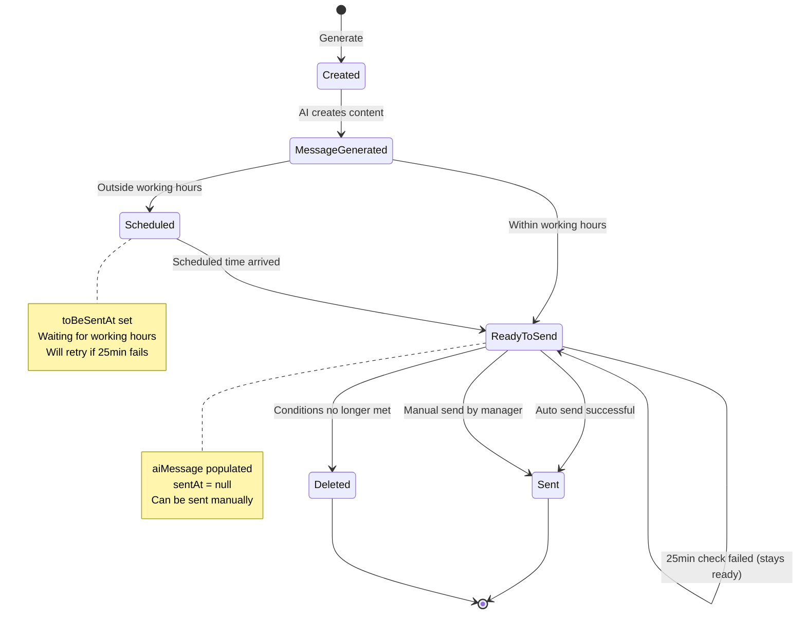

### Generation Types

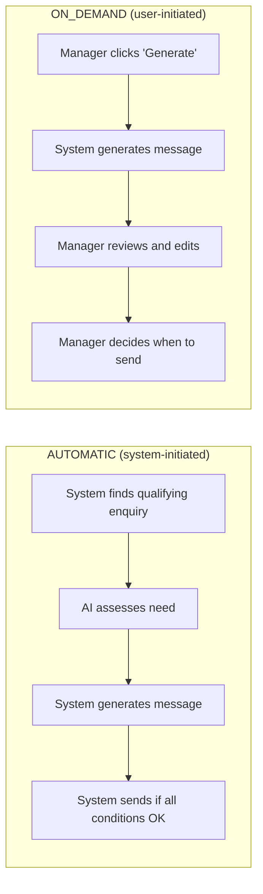

---

## FAQ

### Why wasn't the follow-up generated?

Check these conditions in order:
1. Is RFP/DE status correct? (SENT/ACTIVE for RFP, NEW/IN_PROGRESS for DE)
2. Is enquiry not archived/deleted?
3. Was enquiry created within last 3 months?
4. Is event date in the future?
5. Does a manager message exist?
6. Is the last manager message NOT a follow-up?
7. Is last message between 30 hours and 15 days old?
8. Was this enquiry not assessed in the last 12 hours?

### Why wasn't the follow-up sent automatically?

Check in order:
1. Is `Automatic AI Follow-ups` setting enabled for this manager?
2. Was it during 9:00-17:00 in venue's timezone?
3. Did the client receive another auto-followup in the last 25 minutes?

### Why was the follow-up deleted?

For RFP:
- 15 days passed without manager message
- RFP marked as successful or unsuccessful
- RFP has declined custom offer
- RFP was accepted
- Event is less than 7 days away
- Client wrote a new message

For Direct Enquiry:
- 15 days passed without manager message
- DE marked as confirmed or lost
- Event is less than 7 days away
- Client wrote a new message

### What happens if 25-minute check fails?

**It depends on when the follow-up was generated:**

1. **Outside working hours** → Follow-up was postponed (has `toBeSentAt`) → Will be retried by `SendPostponedFollowUpsCommand` → **This is a DELAY**

2. **Inside working hours** → Follow-up stays as "ready" → Manager can send manually → **Or wait for new follow-up in next cycle**

### How many follow-ups can a client receive daily?

- Max 1 per 25 minutes automatically (anti-spam)
- Max 1 per RFP/DE per 24 hours (cooldown)
- Only during 9:00-17:00 (working hours)
- Theoretically many, but these limits prevent spam

### Can a manager disable auto-followups?

Yes - setting `Automatic AI Follow-ups` to OFF:
- Follow-ups will still be generated
- But will NOT be sent automatically
- Manager must review and send manually

---

## Key Source Files

| File | Responsibility |
|------|----------------|
| `src/AI/FollowUp/Query/RfpIdsForFollowUpAssessmentQuery.php` | 13 conditions for RFP qualification |
| `src/AI/FollowUp/Query/DirectEnquiriesForFollowUpAssessmentQuery.php` | 11 conditions for DE qualification |
| `src/AI/FollowUp/Service/FollowUpAssessmentTracker.php` | 12-hour assessment lock |
| `src/AI/FollowUp/Service/AutomaticAIFollowUpSenderService.php` | 5 conditions for automatic sending |
| `src/AI/FollowUp/Listener/SendAIFollowUpAutomaticallyOrPostponeListener.php` | Working hours check + postponement |
| `src/AI/FollowUp/Service/WorkingHoursCalculator.php` | 9:00-17:00 working hours |
| `src/AI/FollowUp/Specification/ClientRecentlyReceivedAiAutoFollowUpQuery.php` | 25-minute anti-spam check |
| `src/AI/FollowUp/Console/DeleteObsoleteAIFollowUpsCommand.php` | 7 RFP + 5 DE deletion conditions |
| `src/AI/FollowUp/ValueObject/CooldownStatus.php` | 24-hour cooldown |
| `src/AI/FollowUp/Console/SendPostponedFollowUpsCommand.php` | Retries postponed follow-ups |
